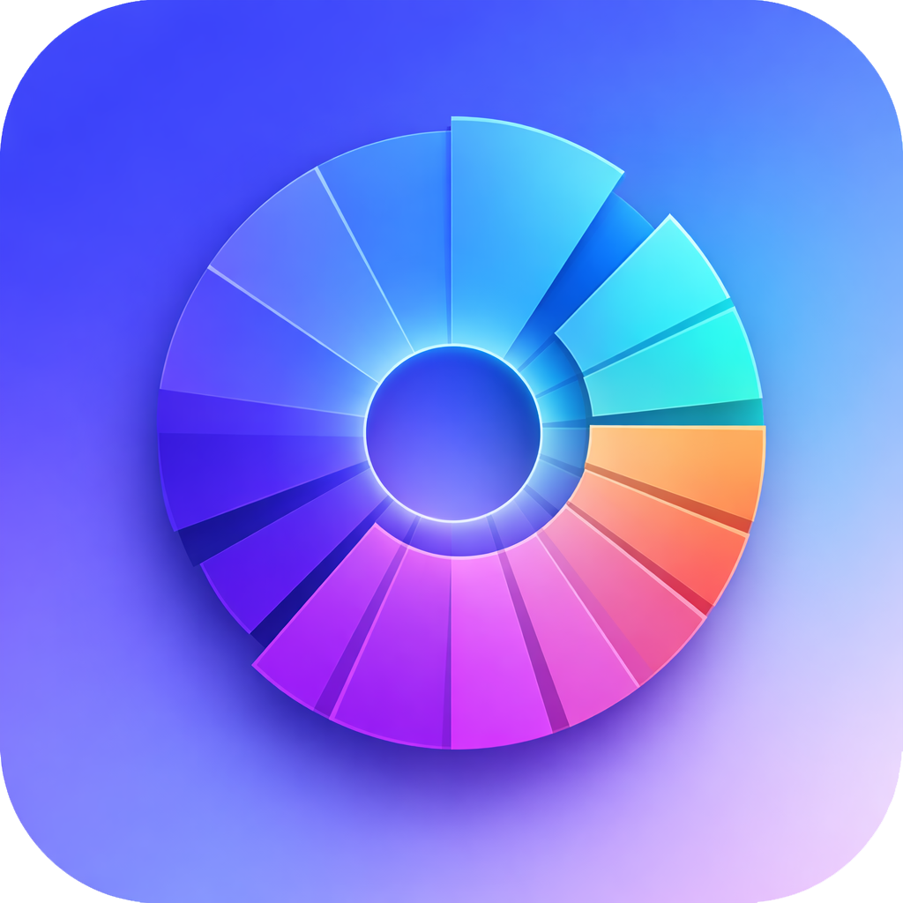

# Diskus

  

  <strong>Cross-platform disk analyzer</strong>

  Visualize your disk usage with interactive sunburst diagrams. 
  Find large folders, move files to the trash with precision.

  
  
  

---

## Download

**Find all releases on GitHub:**

👉 **[View & download releases](https://github.com/cverhoeven/diskus/releases)**

| Platform | Format |
|----------|--------|
| **Windows** | Installer (.exe) or Portable (.exe) |
| **macOS** | DMG or ZIP |

> The first scan of a large drive may take a few seconds.

---

## Tip

**Feel free to leave me a tip, if you like Diskus <3**

## Features

- **Drive selection** – See all scannable drives (hard disks, SSDs, USB sticks) at a glance
- **Sunburst diagram** – Interactive circular visualization of folder sizes, zoomable
- **File list & sidebar** – Resizable sidebar with sorting by name or size
- **Trash collector** – Collect files and move them to the system trash in one action
- **Context menu** – "Show in Explorer" or "Move to trash"

---

## User Guide

### 1. Start – Choose a drive

On startup, you see all available drives. Select a drive to start the scan.

- **Tile or list view** – Switch via the layout icon
- **Capacity bar** – Yellow at 80%, red at 95% usage
- **USB sticks** – Highlighted with a distinct icon

### 2. Disk view – Explore the sunburst

- **Click a segment** – Zoom into the folder
- **Breadcrumb at top** – Navigate back to parent folders
- **Sidebar** – File list of the current folder, width adjustable by drag
- **Sorting** – By name or size, ascending or descending
- **Switch drive** – Dropdown at top left

### 3. Remove files

- **Right-click** on file/folder → **Move to trash** (add to collection list)
- **Trash button** – Opens the collection list
- **"Move to trash"** – Moves all collected files to the system trash

> Files go to the **system trash** and can be recovered from there.

### 4. Open in Explorer

- **Right-click** → **Show in Explorer** – Opens the folder in Windows Explorer or Finder.

---

## Tech Stack

| Area | Technology |
|------|------------|
| Desktop | Electron |
| Frontend | Angular |
| Visualization | D3.js |
| Icons | Lucide |

---

## License

MIT © Carlo Verhoeven

---

  Made with ❤️ in Cologne

